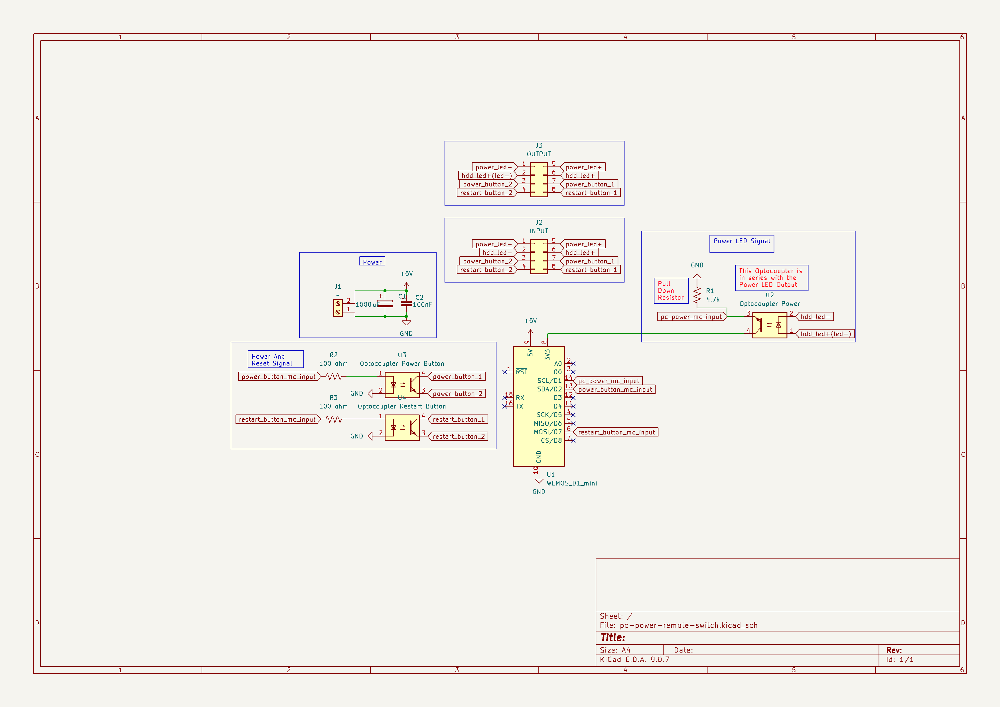
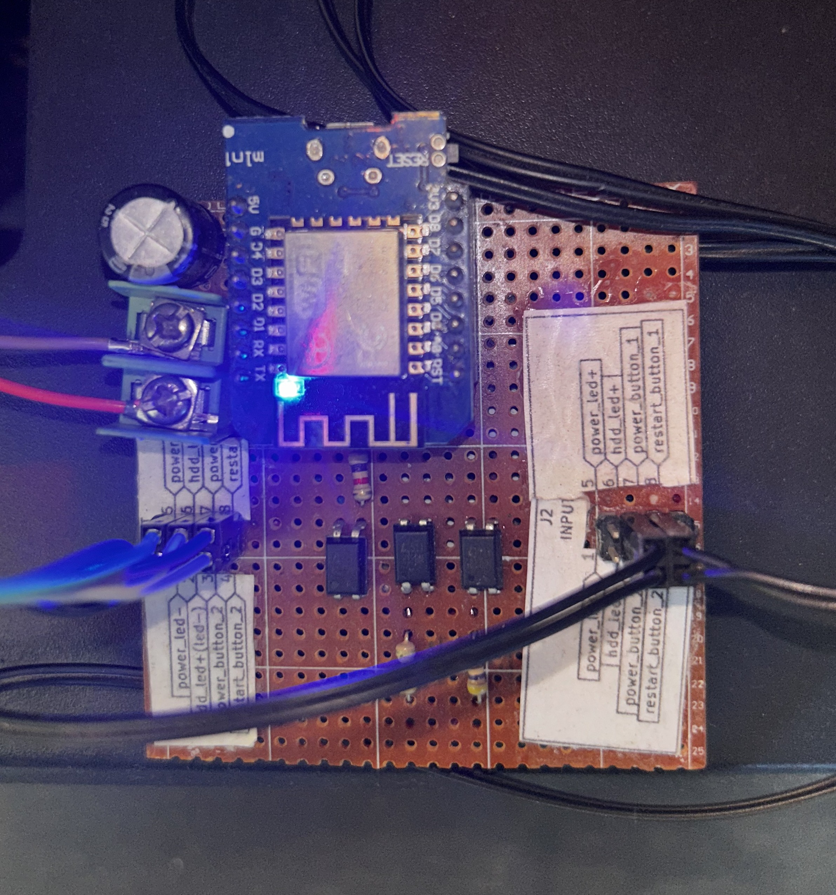

# 🖥️ ComputerControl

> **Remotely power on, restart, and monitor your PC from anywhere in the world** — using an ESP32 microcontroller, MQTT, and a sleek web dashboard.


---

## 📋 Table of Contents

- [Overview](#overview)
- [Architecture](#architecture)
- [Features](#features)
- [Schematic](#schematic)
- [Pin Mapping](#pin-mapping)
- [Hardware Requirements](#hardware-requirements)
- [Software Prerequisites](#software-prerequisites)
- [Getting Started](#getting-started)
  - [1. Flash the ESP32 Firmware](#1-flash-the-esp32-firmware)
  - [2. Configure WiFi & MQTT](#2-configure-wifi--mqtt)
  - [3. Deploy the Web Dashboard](#3-deploy-the-web-dashboard)
- [MQTT Topic Reference](#mqtt-topic-reference)
- [Security Features](#security-features)
- [Project Structure](#project-structure)
- [Legacy System](#legacy-system)
- [Contributing](#contributing)
- [License](#license)

---

## Overview

**ComputerControl** is an IoT project that lets you control your PC's power and restart buttons remotely over the internet. An ESP32 physically connects to your PC's front-panel headers via relay modules and monitors the power LED to detect the PC's on/off state.

The system communicates over **MQTT** (with WebSocket support), enabling a static web dashboard — deployable on **Cloudflare Pages** or any CDN — to send commands and receive real-time status updates from anywhere.

---

## Architecture

```
┌──────────────────────────────────────────────────────────────────┐
│                        CLOUD / INTERNET                          │
│                                                                  │
│  ┌─────────────────────┐         ┌────────────────────────────┐  │
│  │   Web Dashboard     │◄──WSS──►│     MQTT Broker            │  │
│  │  (Cloudflare Pages) │         │  (broker.emqx.io or self)  │  │
│  │                     │         │                            │  │
│  │  • Power ON/OFF     │         │  Topics:                   │  │
│  │  • Restart          │         │  computercontrol/{id}/...  │  │
│  │  • Live status      │         │    /status                 │  │
│  │  • Activity log     │         │    /command                │  │
│  └─────────────────────┘         │    /response               │  │
│                                  │    /lwt                    │  │
│                                  └────────────┬───────────────┘  │
│                                               │                  │
└───────────────────────────────────────────────┼──────────────────┘
                                                │ MQTT (TCP 1883)
                                                │
┌───────────────────────────────────────────────┼──────────────────┐
│  LOCAL NETWORK                                │                  │
│                                               │                  │
│                        ┌──────────────────────▼───────────────┐  │
│                        │         ESP32 WROOM-32               │  │
│                        │                                      │  │
│                        │  GPIO 25 ──► Power Relay ──► PWR_SW  │  │
│                        │  GPIO 26 ──► Restart Relay ► RST_SW  │  │
│                        │  GPIO 34 ◄── PC Power LED (input)    │  │
│                        │  GPIO  2 ──► Onboard LED (status)    │  │
│                        │                                      │  │
│                        │  WiFiManager captive portal          │  │
│                        │  Config reset via BOOT button        │  │
│                        └──────────────────────────────────────┘  │
│                                       │                          │
│                              ┌────────▼────────┐                 │
│                              │    Your PC      │                 │
│                              │  (ATX headers)  │                 │
│                              └─────────────────┘                 │
└──────────────────────────────────────────────────────────────────┘
```

---

## Features

### Firmware (ESP32)
- **Relay control** — Momentary press simulation for power and restart buttons
- **PC status monitoring** — Reads the motherboard power LED to detect ON/OFF state
- **WiFiManager** — No hardcoded WiFi credentials; configure via captive portal
- **MQTT with LWT** — Last Will & Testament for instant offline detection
- **Rate limiting** — Prevents accidental rapid-fire relay triggers (3s cooldown)
- **Persistent config** — MQTT settings saved to flash via the `Preferences` library
- **Config reset** — Hold the BOOT button on power-up to factory reset

### Web Dashboard
- **Modern glassmorphism UI** — Dark theme with ambient background effects
- **Real-time status ring** — Visual indicator for PC online/offline/unknown states
- **MQTT over WebSocket** — Connects via `wss://` for TLS-encrypted communication
- **Activity log** — Timestamped log of all events and commands
- **Toast notifications** — Non-intrusive feedback for actions and errors
- **Settings persistence** — Browser `localStorage` with base64 encoding
- **Auto-disconnect** — Automatically disconnects after 30 minutes of inactivity
- **Responsive design** — Works on desktop, tablet, and mobile

---

## Schematic

The circuit schematic is designed in **KiCad** and included in the [`kicad-circuit/`](kicad-circuit/) directory.



> Full schematic available as [PDF](kicad-circuit/scematic.pdf) and [SVG](kicad-circuit/pc-power-remote-switch.svg). The KiCad project files (`.kicad_sch`, `.kicad_pcb`, `.kicad_pro`) are also included for editing.



### Key Circuit Details

| Component | Connection | Purpose |
|---|---|---|
| **Relay Module 1** | ESP32 GPIO 25 → Relay IN | Simulates PC power button press |
| **Relay Module 2** | ESP32 GPIO 26 → Relay IN | Simulates PC restart button press |
| **Voltage Divider / Optocoupler** | PC Power LED → ESP32 GPIO 34 | Safely reads the PC power LED state |
| **ESP32 Onboard LED** | GPIO 2 | Visual feedback (MQTT connected, boot, etc.) |

### Wiring to ATX Front Panel Headers

The relay outputs connect **in parallel** to the motherboard's front-panel power switch (`PWR_SW`) and reset switch (`RST_SW`) headers. When the ESP32 activates a relay for 500ms, it mimics a physical button press.

```
Motherboard PWR_SW Header:       Motherboard RST_SW Header:
  ┌───┐                            ┌───┐
  │ + ├──── Relay 1 COM            │ + ├──── Relay 2 COM
  │ - ├──── Relay 1 NO             │ - ├──── Relay 2 NO
  └───┘                            └───┘
```

> **⚠️ Note:** GPIO 34 is an *input-only* pin on the ESP32 — perfect for reading the PC power LED but cannot output signals.

---

## Pin Mapping

| GPIO | Direction | Function | Notes |
|-----:|-----------|----------|-------|
| `34` | Input | PC Power LED sensor | Input-only GPIO, no internal pull-up |
| `25` | Output | Power relay trigger | Active HIGH for 500ms |
| `26` | Output | Restart relay trigger | Active HIGH for 500ms |
| `2`  | Output | Onboard LED | Indicates MQTT connection & boot |
| `0`  | Input | Config reset button | Hold LOW on boot to reset WiFi/MQTT settings |

---

## Hardware Requirements

| Component | Quantity | Notes |
|---|:---:|---|
| ESP32 WROOM-32 DevKit | 1 | Any ESP32 dev board with GPIO access |
| 5V Relay Module (1-channel) | 2 | One for power, one for restart |
| Jumper Wires (F-F, M-F) | ~10 | For connecting ESP32, relays, and ATX headers |
| USB Cable (Micro-USB / Type-C) | 1 | For flashing and powering the ESP32 |
| PC with ATX Motherboard | 1 | Target PC to control |
| Optocoupler / Voltage divider | 1 | *(Optional)* For safe PC LED reading via GPIO 34 |

---

## Software Prerequisites

| Tool | Purpose | Install |
|------|---------|---------|
| [PlatformIO](https://platformio.org/install/cli) | Firmware build & flash | VS Code extension or CLI |
| [Node.js](https://nodejs.org/) (v18+) | Web dashboard development | Download from nodejs.org |
| [Git](https://git-scm.com/) | Version control | Download from git-scm.com |

---

## Getting Started

### 1. Flash the ESP32 Firmware

```bash
# Clone the repository
git clone https://github.com/Rudra2002/ComputerControl.git
cd ComputerControl

# Build and upload the firmware
cd firmware
pio run --target upload

# Monitor serial output (optional)
pio device monitor --baud 115200
```

> The firmware automatically installs its dependencies (`PubSubClient`, `ArduinoJson`, `WiFiManager`) via PlatformIO.

### 2. Configure WiFi & MQTT

On first boot (or after a config reset), the ESP32 creates a WiFi access point:

| Setting | Value |
|---|---|
| **SSID** | `ComputerControl-Setup` |
| **Password** | `setup1234` |
| **Portal timeout** | 180 seconds |

1. Connect to the `ComputerControl-Setup` WiFi network from your phone or laptop
2. A captive portal opens automatically — enter your **WiFi credentials**
3. Scroll down to **MQTT Configuration** and fill in:
   - **MQTT Broker Host** — e.g. `broker.emqx.io` (free public broker)
   - **MQTT Broker Port** — `1883` (TCP) or `8084` (WebSocket TLS on EMQX)
   - **Device ID** — A unique name like `my-pc-ctrl` (used to build MQTT topics)
   - **MQTT Username / Password** — optional, depends on your broker
4. Click **Save** — the ESP32 connects to WiFi and the MQTT broker

> **To reset configuration:** Hold the **BOOT** button (GPIO 0) while powering on the ESP32. The LED will blink rapidly, and the captive portal will reappear.

### 3. Deploy the Web Dashboard

#### Local Development

```bash
cd web
npm install
npm run dev
# Opens at http://localhost:3000
```

#### Production Build (for Cloudflare Pages, Netlify, etc.)

```bash
cd web
npm run build
# Output in web/dist/ — deploy this folder
```

#### Connecting the Dashboard

1. Open the web dashboard in your browser
2. Enter your MQTT broker's **WebSocket URL** — e.g. `wss://broker.emqx.io:8084/mqtt`
3. Enter the **Device ID** you configured on the ESP32
4. *(Optional)* Enter MQTT username/password if your broker requires authentication
5. Click **Connect** — the dashboard will show real-time PC status

---

## MQTT Topic Reference

All topics follow the pattern: `computercontrol/{device_id}/...`

| Topic | Direction | QoS | Payload | Description |
|---|---|:---:|---|---|
| `…/status` | ESP32 → Web | 0 | `{"pc":1,"uptime":3600,"rssi":-55,"ip":"192.168.1.100"}` | Periodic status (every 2s) |
| `…/command` | Web → ESP32 | 1 | `{"action":"power"}` | Send command (`power`, `restart`, `status`) |
| `…/response` | ESP32 → Web | 0 | `{"success":true,"message":"Power button pressed"}` | Command acknowledgement |
| `…/lwt` | Broker → Web | 1 | `{"online":false}` | Last Will — sent when ESP32 disconnects |

---

## Security Features

| Feature | Layer | Description |
|---|---|---|
| WiFiManager Portal | Firmware | No hardcoded WiFi credentials |
| MQTT Authentication | Firmware + Web | Optional username/password for broker access |
| Command Rate Limiting | Firmware | Min 3-second interval between relay commands |
| Topic Namespacing | MQTT | Unique device ID isolates traffic |
| LWT (Last Will) | MQTT | Broker notifies dashboard if ESP32 drops offline |
| WSS (TLS) | Web | Web dashboard connects via encrypted WebSocket |
| Inactivity Auto-Disconnect | Web | Dashboard disconnects after 30 min of inactivity |
| Settings Obfuscation | Web | localStorage settings encoded with base64 |

---

## Project Structure

```
ComputerControl/
├── firmware/                  # ESP32 firmware (PlatformIO)
│   ├── platformio.ini         # Build config & dependencies
│   └── src/
│       ├── config.h           # Pin definitions, timing, MQTT defaults
│       └── main.cpp           # Main firmware — WiFi, MQTT, relay logic
│
├── web/                       # Web dashboard (Vite + vanilla JS)
│   ├── index.html             # Dashboard HTML (connect screen + dashboard)
│   ├── package.json           # npm dependencies (mqtt.js)
│   ├── vite.config.js         # Vite dev server config
│   └── src/
│       ├── main.js            # MQTT client, UI logic, command handling
│       └── style.css          # Glassmorphism dark theme, animations
│
├── kicad-circuit/             # Hardware schematic (KiCad 8)
│   ├── pc-power-remote-switch.kicad_sch   # Schematic source
│   ├── pc-power-remote-switch.kicad_pcb   # PCB layout
│   ├── pc-power-remote-switch.kicad_pro   # KiCad project file
│   ├── scematic.png           # Schematic render (PNG)
│   ├── scematic.pdf           # Schematic render (PDF)
│   └── pc-power-remote-switch.svg         # Schematic render (SVG)
│
├── LeagacySystem/             # Legacy ESP8266 firmware (archived)
│   ├── esp8266_dashboard/     # Original ESP8266 web server dashboard
│   ├── main_firmware_alpha/   # Alpha firmware
│   ├── check_output_pin/      # GPIO test sketch
│   └── file_upload_littlefs_webserver/    # LittleFS file server
│
├── .gitignore
└── README.md                  # ← You are here
```

---

## Legacy System

The `LeagacySystem/` directory contains the original ESP8266-based implementation that served a web dashboard directly from the microcontroller via LittleFS. This has been superseded by the current ESP32 + MQTT architecture, which offers:

- ✅ **Remote access** — Control from anywhere, not just on local network
- ✅ **Separation of concerns** — Web frontend hosted independently on a CDN
- ✅ **Better security** — MQTT authentication, TLS, rate limiting
- ✅ **Reliability** — LWT for offline detection, auto-reconnect

The legacy code is kept for reference purposes.

---

## Contributing

1. **Fork** the repository
2. **Create** a feature branch (`git checkout -b feature/my-feature`)
3. **Commit** your changes (`git commit -m 'Add my feature'`)
4. **Push** to the branch (`git push origin feature/my-feature`)
5. Open a **Pull Request**

---

## License

This project is open source and available under the [MIT License](LICENSE).

---

<p align="center">
  Built with ❤️ using ESP32 + MQTT + Vite<br/>
  <sub>Designed & developed by <a href="https://github.com/Rudra2002">Rudra</a></sub>
</p>
